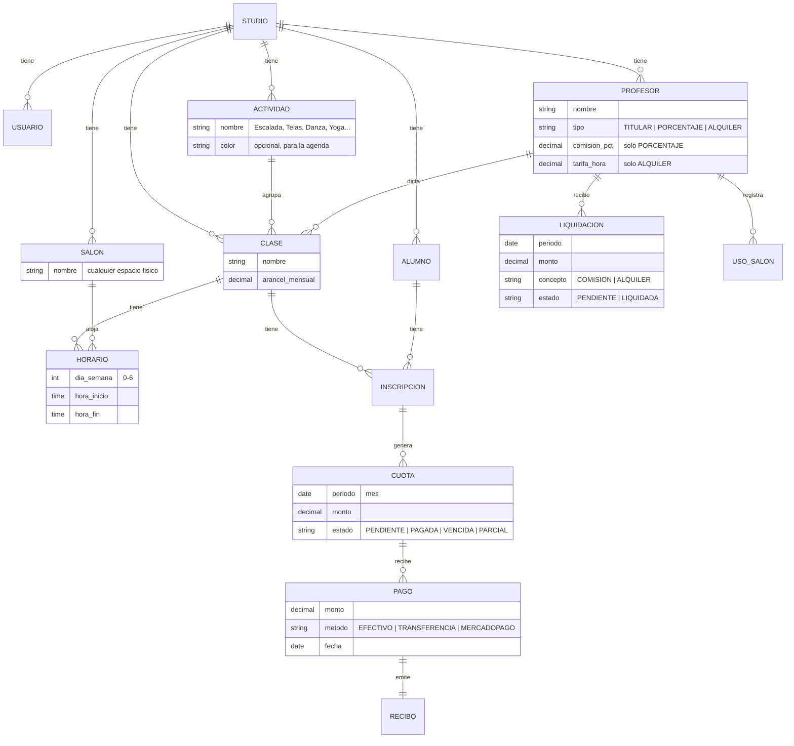
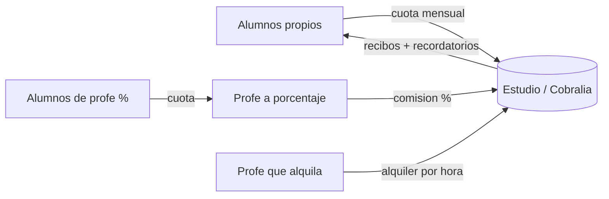

# Cobralia — Documento de producto (v0.1)

> **En una línea:** Cobralia es la app de cobranzas para estudios, gimnasios y espacios de clases de cualquier tipo. Cobrás la cuota mensual de tus alumnos, controlás morosos, mandás recordatorios y recibos, y liquidás lo que te deben los profes que dan clase en tu espacio — todo desde el celu o la compu.

---

## 1. Validación (¿vale la pena?)

**Sí, con matices.**

**A favor**
- Sos tu propio primer cliente: es un dolor real, mensual y concreto. Construir para vos mismo es la mejor validación posible.
- Categoría con demanda probada y modelo recurrente (SaaS).
- Nicho desatendido: el ángulo *multi-profe* (porcentaje / alquiler) y la liquidación automática casi nadie lo resuelve bien.
- Contexto Argentina: efectivo, transferencia y Mercado Pago. Las herramientas internacionales suelen asumir tarjeta/Stripe.

**Competencia**
- Existe bastante software de gestión para academias/estudios (CrossHero, AcadeSoft, DanzaGest, DStudio, Clubworx, Zenamu, ismygym, etc.).
- Casi todos son "todo en uno" pesados (reservas, asistencia, control de acceso, marketing), varios pensados para España y con cobros vía Stripe.
- **No competís en features**: competís en *foco* (solo cobranzas) y *contexto* (Argentina + el modelo de profes invitados).

**En contra / riesgos**
- Distribución > construcción. Vender a estudios chicos es el verdadero trabajo.
- Sensibilidad al precio → riesgo de churn.
- Automatizar WhatsApp tiene costo y fricción (BSP + plantillas).
- Ser "hub de pagos" (cobrar vos en nombre de los profes y repartir) mete complejidad regulatoria → **evitarlo al principio**.

**Veredicto:** construilo, pero empezá usándolo vos en tu estudio con un MVP chico. Si te resuelve el mes a vos, le sirve a otros.

---

## 2. Nombre y dominio

**Recomendación: usar `Cobralia` como marca principal del producto.**

- Landing/marketing: `cobralia.com`
- App de gestión: `app.cobralia.com`
- **A evitar por ahora:** `docentes.cobralia.com`

> Usé `.com` como ejemplo; aplicá la misma estructura al TLD que ya tengas (p. ej. `cobralia.com.ar` → `app.cobralia.com.ar`).

**Por qué:** el nombre ya describe el trabajo (cobranzas), es corto, se pronuncia bien en español y ya tenés el dominio (costo cero). `docentes.cobralia` da a entender que "docentes" es una de varias verticales de una plataforma mayor, y eso diluye el foco. Mejor que **Cobralia sea el producto**. Si en el futuro sumás verticales (comercios, profesionales), ahí sí tiene sentido namespacear con subdominios o paths.

**Posicionamiento:** *"Cobranzas para estudios y para quienes dan clases."* Sirve tanto a un docente solo como a un estudio con varios profes.

---

## 3. ¿Para quién? (personas)

1. **Dueño/a de un espacio que también da clases** (estudio, gimnasio, sala multiuso): administra alumnos propios **+** profes invitados, aunque en el mismo salón se dicten actividades distintas (p. ej. escalada y telas en horarios distintos). Es el perfil con más valor.
2. **Docente independiente sin estudio**: solo administra sus alumnos. Es el caso más simple → buen on-ramp para captar usuarios.
3. *(futuro)* **Secretaria / admin del estudio**: rol con permisos acotados.

---

## 4. Propuesta de valor y diferenciación

- **Simple y enfocado en cobranzas**, no un ERP del estudio.
- **Para cualquier espacio de clases**: estudios, gimnasios, salas multiuso. Un mismo salón puede alojar actividades distintas (escalada, telas, danza, yoga) en horarios distintos, sin pisarse.
- **Pensado para Argentina**: efectivo + transferencia + Mercado Pago, recibos, recordatorios por WhatsApp.
- **Diferencial fuerte**: administrar a los profes que dan clase en tu espacio con dos modelos —**porcentaje** (cobran a sus alumnos y te pagan un %) y **alquiler** (pagan el espacio por hora)— y **liquidarlos automáticamente**. (Calza perfecto con un espacio multiactividad donde cada instructor trabaja distinto.)

---

## 5. Modelo de dominio

**Notas de las entidades**
- **STUDIO** = el *tenant*. Todo cuelga de un `studio_id` (clave para el multi-tenant).
- **SALON** = cualquier espacio físico (sala, salón, box, pared de escalada). Es el recurso que se comparte.
- **ACTIVIDAD** = la disciplina (Escalada, Telas, Danza, Yoga, Spinning…). Permite organizar la agenda y medir cuánto facturás por actividad.
- **CLASE** = una clase concreta de una actividad, dictada por un profe. Tiene su arancel y uno o más **HORARIO**.
- **HORARIO** = franja recurrente (día + hora inicio/fin) en un **SALON**. Al vivir el espacio en el horario, podés **detectar conflictos** (dos clases en la misma sala a la misma hora) y mostrar la **agenda de cada sala**.
- **PROFESOR** con `tipo`: `TITULAR` (vos/dueño, alumnos propios), `PORCENTAJE` (comisión sobre lo que cobra) o `ALQUILER` (paga por hora de salón).
- **CUOTA** se genera por período (mes) a partir de la inscripción. Acepta pagos parciales.
- **LIQUIDACION** resuelve lo que el profe te debe: comisión (PORCENTAJE) o alquiler de horas (ALQUILER).
- **USO_SALON**: horas que un profe `ALQUILER` usó un salón → alimenta la liquidación.

> **Espacio compartido / multiactividad.** Ejemplo: en tu gimnasio, el **Salón 1** aloja *Escalada* (lun y mié 18–19) y *Telas* (mar y jue 20–21). Son dos `Clase` de dos `Actividad` distintas, cada una con sus `Horario` apuntando al mismo `Salon`. El sistema valida que no se solapen y te muestra la grilla de la sala. *(Más adelante, además de la cuota mensual, se pueden sumar packs/bonos y pago por clase suelta, típicos de gimnasios.)*

---

## 6. Flujos de dinero

Tres fuentes de ingreso a mostrar separadas en el dashboard:
1. **Cuotas de alumnos propios** (ingreso directo).
2. **Comisiones** de profes a porcentaje.
3. **Alquiler** de profes por hora.

> **Decisión importante (MVP):** Cobralia **no mueve plata de terceros**. El sistema *registra* lo cobrado y *calcula* lo que cada profe te debe; vos marcás la liquidación como saldada. Convertir a Cobralia en intermediario de pagos (cobrar a los alumnos del profe y repartir) implica modelo *marketplace* / split payments con su carga regulatoria → dejarlo para una fase avanzada.

---

## 7. Alcance del MVP

**Sí**
- Login del dueño + creación del estudio (multi-tenant desde el día 1).
- ABM de salones.
- ABM de alumnos.
- ABM de clases (arancel mensual, día/horario, salón, profe).
- Inscribir alumnos en clases.
- Generación automática de cuotas mensuales.
- Registrar pagos (efectivo / transferencia) y estados: pendiente / pagada / vencida / parcial.
- Recibo en PDF.
- Dashboard de totales (cobrado, pendiente, vencido).
- Recordatorio manual: botón que arma un link `wa.me` con texto prellenado ("hola {alumno}, te recuerdo la cuota de {mes}…").

**No (todavía)**
- WhatsApp automático.
- Cobro online integrado.
- Liquidación de profes invitados.
- Reservas/uso de salón por hora.
- Roles múltiples y portal del alumno.
- Onboarding self-serve de otros estudios.

---

## 8. Roadmap por fases

**Fase 1 — MVP (para vos)**
Lo de arriba. Objetivo: reemplazar tu Excel/cuaderno y dejar de perseguir morosos a mano.

**Fase 2 — Profes invitados + automatización**
- Profes `PORCENTAJE` y `ALQUILER` + liquidaciones.
- Registro de uso de salón por hora.
- Recordatorios automáticos (WhatsApp Business Platform vía BSP, o email).
- Cobro online con Mercado Pago (link de suscripción).

**Fase 3 — SaaS**
- Onboarding self-serve, multi-tenant productivo.
- Cobranza de la propia Cobralia (suscripción a los estudios).
- Roles (admin/secretaria), portal del alumno, reportes y exportaciones.

---

## 9. Notas técnicas (stack)

- **Framework:** Next.js (App Router) full-stack. Con *server actions* / *route handlers* probablemente **no necesitás un Express separado**; si preferís separar la API, Express sigue siendo opción. Para un dev solo, Next full-stack es lo más rápido.
- **DB:** PostgreSQL (relacional, encaja perfecto: muchas relaciones, dinero, integridad).
- **ORM:** Prisma (excelente con Next + TypeScript).
- **Auth:** Auth.js (NextAuth) o Clerk. Ojo con el *scoping por `studio_id`* en cada query desde el principio.
- **Deploy:** Vercel (Next) + Postgres administrado (Neon / Supabase / Railway).
- **Recibos PDF:** `pdfkit`, `@react-pdf/renderer` o Puppeteer.
- **Multiplataforma:** una **PWA responsive** cubre celu y compu sin apps nativas. Es exactamente lo que pediste ("tanto el celu como la compu").

---

## 10. Recordatorios / notificaciones

- **MVP:** links `wa.me` con texto prellenado. Gratis, los mandás vos a mano, cero fricción técnica. (Evita aprobación de plantillas y costos por mensaje al arranque.)
- **Fase 2:** WhatsApp Business Platform vía un BSP (Twilio, WATI, MessageBird, etc.). Meta **no** da acceso directo a la mayoría de los negocios.
  - Los recordatorios de pago son legítimamente **utility** → tarifas bajas (en Latinoamérica, centavos).
  - Las respuestas dentro de la **ventana de servicio de 24h** son gratis.
  - Categorizar honesto: meter una promo en plantilla "utility" hace que Meta la rechace o la reclasifique.
  - *Verificá las tarifas vigentes por país en la página oficial de Meta antes de presupuestar.*
- **Email** como fallback (más barato, menos tasa de apertura).

---

## 11. Cobro online (Mercado Pago)

- **Suscripciones (preapproval):** definís nombre, monto y frecuencia (semanal a anual; acá: **mensual**), compartís el link por WhatsApp/email, el alumno paga una vez y los cobros siguientes son automáticos. Mercado Pago lo recomienda explícitamente para **escuelas y academias con mensualidades fijas**.
- El alumno **no necesita** cuenta de Mercado Pago para pagar.
- Se puede empezar **no-code** (crear el plan desde la app de MP) y luego **integrar por API** + **webhook** para conciliar pagos contra las cuotas.
- Hay un ejemplo público de **Next.js + Mercado Pago Suscripciones** (repo de goncy) que sirve de base.
- *Verificá montos mínimos/máximos y credenciales (Public Key / Access Token) en el panel de desarrollador.*

---

## 12. Monetización (cómo gana Cobralia)

- **Suscripción mensual por estudio.**
- **Free tier** (ej.: hasta X alumnos) para bajar la barrera de entrada y captar.
- Tiers por cantidad de alumnos/profes o por features (automatización de WhatsApp, cobro online).
- Precios **AR-friendly** dado lo sensible al precio del segmento.
- *Lindo detalle:* Cobralia se cobra a sí misma usando… cobranzas (Mercado Pago Suscripciones). Comés de tu propia cocina.

---

## 13. Riesgos y mitigaciones

| Riesgo | Mitigación |
| --- | --- |
| Distribución cuesta más que construir | Empezá por tu red (comunidad de danza, Instagram), boca a boca, 3–5 estudios amigos. |
| Sensibilidad al precio / churn | Free tier + precio bajo + foco en ahorro de tiempo real (morosidad). |
| Costo/fricción de WhatsApp | `wa.me` manual en MVP; utility templates recién en Fase 2. |
| Complejidad de ser hub de pagos | No mover plata de terceros: solo registrar y liquidar. |
| Competencia "todo en uno" | Nicho + simplicidad + contexto Argentina como foso. |
| Soporte de un fundador solo | Mantener el alcance chico; documentar; automatizar lo repetitivo. |

---

## 14. Métricas para validar

- ¿Lo uso **yo** todos los meses sin volver al Excel? (señal #1)
- ¿3–5 estudios/profes lo adoptan y siguen mes a mes? (retención)
- Reducción de morosidad / tiempo dedicado a cobrar.
- Conversión free → pago (cuando exista).

---

## 15. Próximos pasos

1. Revisar/cerrar el **modelo de dominio** (§5).
2. **Schema de Prisma** + migraciones.
3. Esqueleto **Next.js** con **auth** y **multi-tenant** (`studio_id` scoping).
4. CRUD de **alumnos / clases / inscripciones / cuotas**.
5. **Dashboard** de totales.
6. Botón de **recordatorio `wa.me`** + **recibo PDF**.
7. **Usarlo en tu estudio este mes** y ajustar con lo que duela.
